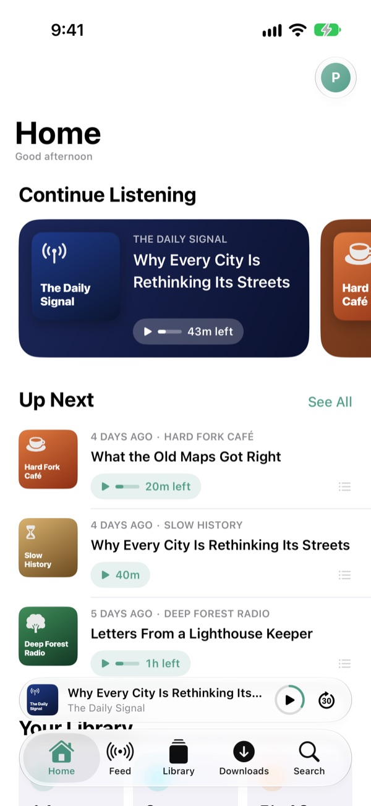
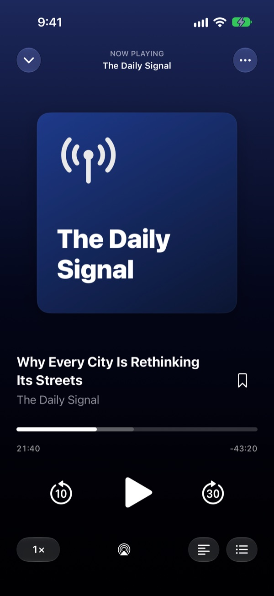
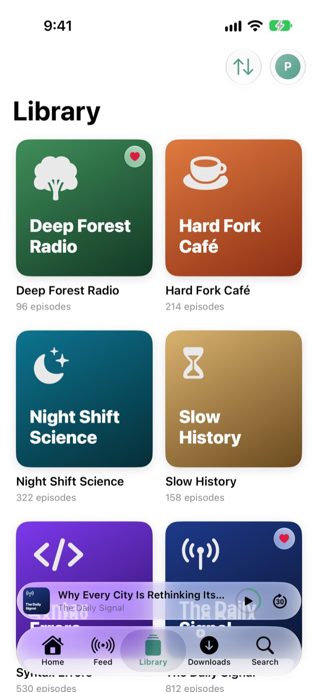
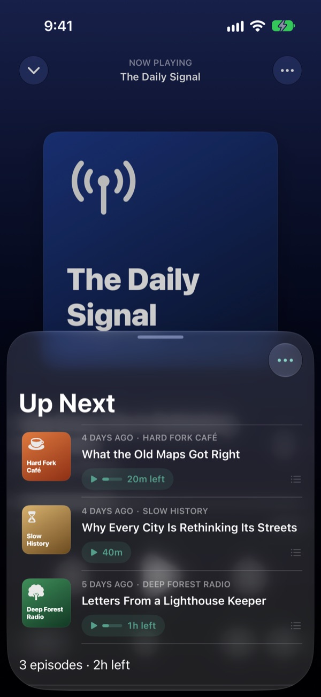
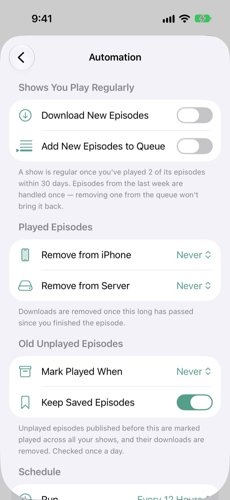
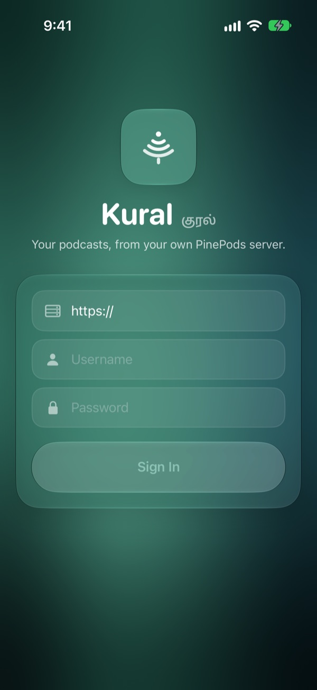

# Kural (குரல்)

**An opinionated, native iOS client for [PinePods](https://github.com/madeofpendletonwool/PinePods) servers.**

*Kural* is Tamil for "voice".

> **Unofficial.** Kural is an independent project. It isn't affiliated with or endorsed by the PinePods project. For the official app, see [PinePods on the App Store](https://apps.apple.com/us/app/pinepods/id6751441116).

<p align="center">
  
  
  
</p>

## What "opinionated" means

The official PinePods mobile app is a cross-platform Flutter client that covers the whole feature set. Kural makes different trade-offs:

- **Native and current-only.** SwiftUI with Liquid Glass, targeting iOS 27 and later, with no compatibility layers for older systems.
- **Listen once, then forget.** Played episodes are cleaned up rather than archived. No transcripts or back-catalog management.
- **Plays without a connection.** Episodes download to the phone, and offline progress is saved on the device and synced to the server later.
- **Automation over manual upkeep.** Rules you set up run on a schedule, with no approval step. They download and queue new episodes of shows you play regularly, remove played downloads, and retire old unplayed episodes.
- **Defers to the server.** Features that PinePods provides server-side are used rather than re-implemented in the app.

Kural covers listening. Server administration, subscriptions, playlists and similar management are left to the PinePods web app.

## Features

- Home, feed, library, search, and show and episode pages
- Up Next queue: play next, reorder, and continue automatically
- Downloads to iPhone in the background, with a storage limit and automatic "keep next N queued" downloads
- Now Playing with artwork-tinted design, AirPlay, speed control, and a lock screen and Control Center player
- Skip Silence (speeds through long pauses)
- Resumes after phone calls and other interruptions
- Automation rules with an activity log
- Ten accent colors, each with a matching app icon
- Home Screen and Lock Screen widgets with play/pause, skip and Up Next

## Screenshots

| Home | Now Playing | Up Next |
|:---:|:---:|:---:|
|  |  |  |
| **Library** | **Automation** | **Sign in** |
|  |  |  |

The shows in these screenshots are sample data from the app's demo mode.

## Requirements

- iOS 27 or later
- A PinePods server (developed against 0.9.0)

## Building

Open `PinePods.xcodeproj` in Xcode 27 and run the `PinePods` scheme, or from the command line:

```sh
xcodebuild -project PinePods.xcodeproj -scheme PinePods -destination 'generic/platform=iOS Simulator' build
xcodebuild test -project PinePods.xcodeproj -scheme PinePods -destination 'platform=iOS Simulator,name=<iOS 27 simulator>'
```

Debug builds include a demo mode with sample data for working on the UI without a server. Launch with `-PinePodsDemo`; see `CLAUDE.md` for the other options. Release builds don't include it.

`scripts/validate_api.py <server-url>` checks every endpoint the app calls against a server's OpenAPI spec.

## Attribution

Kural is built on the work of the **[PinePods](https://github.com/madeofpendletonwool/PinePods)** project by **Collin Pendleton** and its contributors. It talks to the PinePods server API, and much of its playback and sync behavior is ported from the PinePods mobile client. See the PinePods repository for the projects it in turn credits.

## License

Licensed under the **GNU General Public License v3.0**, the same license as PinePods. See [LICENSE](LICENSE).

## Privacy

Kural collects no data. See [PRIVACY.md](PRIVACY.md).
